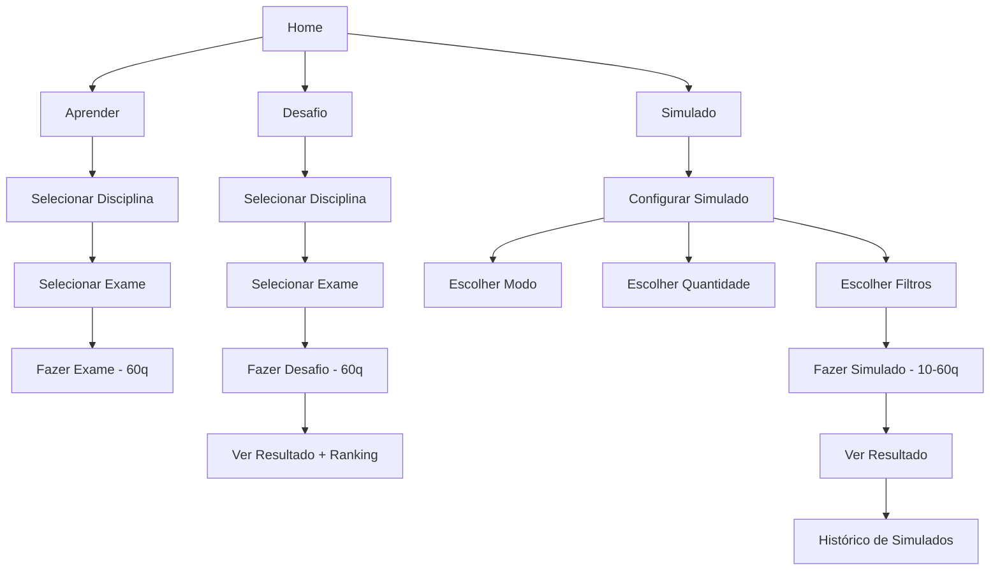

# Arquitetura da Plataforma - Modos de Estudo
## Estrutura Atual e Organização dos Módulos

**Data:** 08/12/2025

---

## 📚 Visão Geral da Arquitetura

A plataforma possui **3 módulos principais** de estudo, cada um com propósito específico:

### 1. **Modo APRENDER** (Study Mode) 📖
- **Rota:** `/study/:examId`
- **Componente:** `StudyPage.tsx`
- **Propósito:** Praticar exames completos com explicações detalhadas
- **Características:**
  - Exames completos (60 questões)
  - Feedback imediato após cada questão
  - Explicações detalhadas
  - Sem limite de tempo
  - Foco no aprendizado

**Fluxo de Navegação:**
```
/disciplines 
  → /disciplines/:disciplineId/exams (modo study)
    → /study/:examId (exame completo)
```

---

### 2. **Modo DESAFIO** (Challenge Mode) 🎯
- **Rota:** `/challenge/start/:examId`
- **Componente:** `ChallengePage.tsx`
- **Propósito:** Testar conhecimento com exames completos cronometrados
- **Características:**
  - Exames completos (60 questões)
  - Cronômetro ativo
  - Sem feedback durante o exame
  - Resultado final com estatísticas
  - Sistema de pontuação e ranking
  - Limite diário para usuários free

**Fluxo de Navegação:**
```
/challenge 
  → /challenge/select-exam/:disciplineId
    → /challenge/start/:examId (exame completo)
```

---

### 3. **Modo SIMULADO** (Simulation Mode) 🎲
- **Rota:** `/simulation/config` → `/simulation/start`
- **Componentes:** 
  - `SimulationConfigPage.tsx` (configuração)
  - `SimulationPage.tsx` (execução)
  - `SimulationResultPage.tsx` (resultado)
  - `SimulationHistoryPage.tsx` (histórico)
- **Propósito:** Simulados personalizados e adaptativos
- **Características:**
  - **NÃO são exames completos**
  - Quantidade personalizável: 10, 20, 30, 50, 60 questões
  - 5 modos diferentes de geração de questões
  - Filtros avançados (disciplina, universidade, ano)
  - Histórico de simulados

**Fluxo de Navegação:**
```
/simulation/config (configurar simulado)
  → /simulation/start (realizar simulado)
    → /simulation/result (ver resultado)
      → /simulation/history (histórico)
```

---

## 🔍 Diferenças Principais

| Aspecto | APRENDER | DESAFIO | SIMULADO |
|---------|----------|---------|----------|
| **Tipo de Conteúdo** | Exame completo | Exame completo | Questões selecionadas |
| **Quantidade** | 60 questões (fixo) | 60 questões (fixo) | 10-60 questões (variável) |
| **Seleção** | Exame específico | Exame específico | Algoritmo personalizado |
| **Feedback** | Imediato | Apenas no final | Apenas no final |
| **Cronômetro** | Não | Sim | Sim |
| **Explicações** | Sim | Sim (no final) | Sim (no final) |
| **Limite Diário** | Premium only | 1/dia (free) | Ilimitado |
| **Pontuação** | Não | Sim (ranking) | Sim (histórico) |

---

## 🎯 Modos de Simulado (5 tipos)

### 1. **Fraquezas** (Weaknesses)
```typescript
mode: 'weaknesses'
```
- Analisa o desempenho do usuário por disciplina
- Seleciona questões das 3 disciplinas com pior desempenho
- Foca em áreas que precisam de melhoria

### 2. **Revisão** (Revision)
```typescript
mode: 'revision'
```
- Busca questões que o usuário **errou anteriormente**
- Ordenadas por data (mais recentes primeiro)
- Ideal para reforçar conceitos não dominados

### 3. **Difíceis** (Difficult)
```typescript
mode: 'difficult'
```
- Questões com `difficulty >= 4`
- Baseado em estatísticas gerais (que a maioria erra)
- Desafio extra para usuários avançados

### 4. **Aleatórias** (Random)
```typescript
mode: 'random'
```
- Seleção completamente aleatória
- Respeita filtros de disciplina e universidade
- Variedade máxima de questões

### 5. **Personalizado** (Custom)
```typescript
mode: 'custom'
```
- Usuário escolhe todos os parâmetros
- Disciplinas específicas
- Universidade (UEM/UP/ambas)
- Quantidade de questões

---

## 📊 Estrutura de Dados

### Exame Completo (usado em Aprender e Desafio)
```typescript
interface Exam {
  id: string;
  disciplineId: string;
  name: string;           // "Exame 2014 – 1ª época"
  year: number;
  season: string;         // "1ª época", "2ª época"
  questionsCount: number; // 60
  createdAt: Timestamp;
  description?: string;
}
```

### Configuração de Simulado
```typescript
interface SimulationConfig {
  mode: 'weaknesses' | 'revision' | 'random' | 'difficult' | 'custom';
  questionCount: 10 | 20 | 30 | 50 | 60;
  disciplineIds: string[];
  includeAllDisciplines?: boolean;
  university?: 'UEM' | 'UP' | 'both';
  yearRange?: {
    from: number;
    to: number;
  };
}
```

### Questão Individual
```typescript
interface Question {
  id: string;
  examId: string;
  statement: string;
  options: string[];      // [A, B, C, D, E]
  correctOption: string;
  explanation?: string;
  disciplineId?: string;
  difficulty?: number;    // 1-5
}
```

---

## 🎨 Interface do Usuário

### Layout de Navegação

```
┌─────────────────────────────────────┐
│         NAVIGATION BAR              │
├─────────────────────────────────────┤
│                                     │
│  📚 Aprender    → Exames completos  │
│  🎯 Desafio     → Exames completos  │
│  🎲 Simulado    → Questões custom   │
│  👥 Grupos                          │
│  📊 Ranking                         │
│  👤 Perfil                          │
│                                     │
└─────────────────────────────────────┘
```

### Fluxo Completo do Usuário



---

## 🔧 Algoritmo de Seleção de Questões (Simulado)

### Exemplo: Modo "Fraquezas"
```typescript
// 1. Buscar desempenho do usuário por disciplina
const disciplineScores = userData?.disciplineScores || {};

// 2. Ordenar disciplinas (pior → melhor)
const weakDisciplines = Object.entries(disciplineScores)
  .sort(([, a], [, b]) => (a as number) - (b as number))
  .slice(0, 3)  // Top 3 piores
  .map(([id]) => id);

// 3. Buscar questões dessas disciplinas
const questionsPerDiscipline = Math.ceil(
  config.questionCount / weakDisciplines.length
);

// 4. Embaralhar e selecionar quantidade exata
const shuffled = shuffleArray(questions);
const selected = shuffled.slice(0, config.questionCount);
```

### Exemplo: Modo "Revisão"
```typescript
// 1. Buscar questões erradas do usuário
const historyQuery = query(
  collection(db, 'questionHistory'),
  where('userId', '==', userId),
  where('wasCorrect', '==', false),
  orderBy('lastAttempt', 'desc'),
  limit(config.questionCount * 2)
);

// 2. Buscar detalhes das questões
const questions = await Promise.all(
  wrongQuestionIds.map(id => getQuestion(id))
);

// 3. Embaralhar e selecionar
return shuffleArray(questions).slice(0, config.questionCount);
```

---

## 📈 Casos de Uso

### Estudante Iniciante
1. **Aprender** → Fazer exames completos com explicações
2. **Simulado (Aleatório)** → Testar conhecimento geral (20-30q)
3. **Simulado (Fraquezas)** → Focar em disciplinas fracas

### Estudante Intermediário
1. **Desafio** → Testar sob pressão com cronômetro
2. **Simulado (Revisão)** → Revisar questões erradas
3. **Simulado (Difíceis)** → Aumentar dificuldade

### Estudante Avançado
1. **Desafio** → Competir no ranking
2. **Simulado (Personalizado)** → Focar em disciplinas específicas
3. **Simulado (60q)** → Simular exame real completo

---

## ✅ Resumo da Arquitetura Atual

### ✅ O que está CORRETO:
1. **Aprender e Desafio** → Exames completos (60 questões)
2. **Simulado** → Questões personalizadas (10-60 questões)
3. Separação clara de propósitos
4. Algoritmos adaptativos no Simulado
5. Sistema de histórico e estatísticas

### 📝 Observações:
- O modo **Simulado** é para prática adaptativa e personalizada
- Os modos **Aprender** e **Desafio** são para exames oficiais completos
- Todos os 3 modos são complementares e servem propósitos diferentes
- A quantidade de 60 questões foi adicionada ao Simulado para permitir simulações de exames completos personalizados

---

**Conclusão:** A arquitetura está bem estruturada e cada módulo tem seu propósito bem definido. Os 200 exames com 60 questões serão usados principalmente nos modos **Aprender** e **Desafio**, enquanto o modo **Simulado** usa essas questões de forma fragmentada e personalizada.
